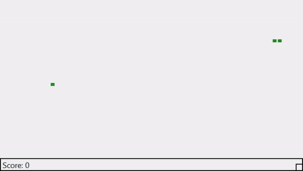

# python-snake-games
A collection of simple snake games written in Python, using multiple graphical user interfaces

[Curses](https://github.com/jd-harris/python-snake-games/tree/master/curses)

[Pyside2](https://github.com/jd-harris/python-snake-games/tree/master/PySide2)

